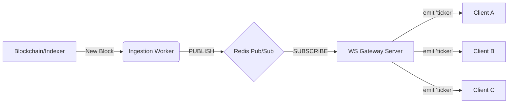

# Real-Time Architecture & WebSocket Specification

## 1. Overview

To replicate the "live" feel of a CEX (Centralized Exchange) or high-performance DEX, we cannot use standard HTTP requests. This document defines the architecture for the **Real-Time Data Layer**, which pushes data from the blockchain/backend to the client in milliseconds.

**Core Principle:** Push-based delivery using a **Pub/Sub** model.
**Technology Stack:** Node.js (Custom Server) + Socket.io + Redis.

---

## 2. Architecture Diagram

The flow of data follows a unidirectional pipeline:

1.  **Ingestion Worker:** Watches Blockchain/Indexer for new events (Price change, Trade, Order fill).
2.  **Redis Publisher:** Ingestion Worker publishes event to a Redis Channel.
3.  **WebSocket Gateway:** A dedicated Node.js server subscribes to Redis.
4.  **Client (Frontend):** Connects to WS Gateway and receives updates.



# Real-Time Architecture & WebSocket Specification

## 1. Executive Summary

This document defines the technical implementation of the Real-Time Data Layer. This system replaces standard HTTP polling with a **bi-directional WebSocket (WSS)** connection, ensuring that market data (tickers, trades, order books) is pushed to the client with sub-100ms latency.

**Core Philosophy:** "Push, don't Pull."
**Primary Stack:** Node.js (Gateway), Redis (Pub/Sub), Socket.io (Transport), Redux Toolkit (State).

---

## 2. System Architecture

The architecture consists of three distinct layers:

### A. The Publisher Layer (Ingestion)

- **Role:** Fetches raw data from the source (Blockchain Node, Indexer, or Aggregator).
- **Behavior:** It does **not** speak to clients directly. It only speaks to Redis.
- **Action:** Detects a price change -> Publishes a JSON payload to a specific Redis Channel.

### B. The Broker Layer (Redis Pub/Sub)

- **Role:** Acts as the high-speed message bus. Decouples the ingestion speed from the client connection speed.
- **Persistence:** No persistence required for live stream; purely ephemeral messaging.

### C. The Delivery Layer (WebSocket Gateway)

- **Role:** A dedicated Node.js service (separate from Next.js).
- **Behavior:** 1. Subscribes to Redis channels. 2. Maintains persistent TCP/WSS connections with thousands of Frontend Clients. 3. Broadcasts Redis messages to specific Socket.io "Rooms".

[Image of WebSocket architecture diagram]

---

## 3. Data Protocols & Channel Design

We use a **Topic-Based Subscription** model. Clients only receive data for the specific markets they are viewing.

### Redis Channel Schema

The Ingestion Worker must publish to these exact channel patterns:

| Data Type       | Redis Channel Pattern    | Frequency       | Payload Description                      |
| :-------------- | :----------------------- | :-------------- | :--------------------------------------- |
| **Ticker**      | `market:ticker:{symbol}` | Throttle: 100ms | 24h stats, current price, volume.        |
| **Order Book**  | `market:book:{symbol}`   | Real-time       | Depth updates (bids/asks).               |
| **Trades**      | `market:trades:{symbol}` | Real-time       | Stream of executed trades.               |
| **User Orders** | `user:{userId}:orders`   | Event-driven    | Private order status (FILLED, CANCELED). |

### Payload Specifications

#### 1. Ticker Payload (Public)

```json
{
  "type": "ticker",
  "symbol": "ETH-USDC",
  "ts": 1708890000000,
  "data": {
    "lastPrice": "3050.25",
    "priceChangePercent": "2.45",
    "high24h": "3100.00",
    "low24h": "2950.00",
    "volume24h": "15400.55"
  }
}
```

This detailed specification focuses exclusively on the **Order Book**, which is the most complex real-time component. It requires a specific "Snapshot + Delta" strategy to ensure data consistency without consuming massive bandwidth.

Add this as a sub-section or a new file `md/orderbook.spec.md`.

---

# Order Book Implementation Strategy

## 1. The Data Protocol (Snapshot + Delta)

Streaming a full Order Book (e.g., 100 bids + 100 asks) every second is too heavy. We use a **Hybrid Approach**.

### Phase A: The Snapshot (REST API)

When the user _first_ loads the page, fetch the full state via HTTP.

- **Endpoint:** `GET /api/v1/market/depth?symbol=ETH-USDC`
- **Response:**

```json
{
  "lastUpdateId": 1050, // Sequence Number (Critical)
  "bids": [
    ["3000.00", "1.5"],
    ["2999.00", "10.0"]
  ],
  "asks": [
    ["3001.00", "5.0"],
    ["3002.00", "2.1"]
  ]
}
```

### Phase B: The Delta Stream (WebSocket)

Immediately after fetching the snapshot, subscribe to the WebSocket. The WS sends _only_ changes.

- **Event:** `depthUpdate`
- **Payload:**

```json
{
  "e": "depthUpdate",
  "s": "ETH-USDC",
  "u": 1060, // Final Update ID
  "U": 1051, // First Update ID
  "b": [
    ["2999.00", "0.0"],
    ["3000.50", "2.0"]
  ], // Bids to update
  "a": [] // Asks to update
}
```

- **Logic:**
- `"0.0"` quantity means **DELETE** that price level.
- Any other quantity means **UPDATE** or **INSERT** that level.

---

## 2. Synchronization Algorithm (The "Buffer" Logic)

You cannot simply apply updates immediately because the WebSocket might connect _before_ the HTTP Snapshot arrives, or packets might arrive out of order.

**The Algorithm:**

1. **Open Buffer:** Start buffering WS `depthUpdate` events immediately into a distinct array `wsBuffer`.
2. **Fetch Snapshot:** Call the HTTP API to get the base state (`lastUpdateId: 1050`).
3. **Process Buffer:**

- Discard any WS event where `u` (Final ID) < `1050` (Old data).
- Find the first WS event where `U` <= `1050` + 1 and `u` >= `1050` + 1.
- Apply that event and all subsequent events in the buffer.

4. **Live Mode:** Once the buffer is cleared, switch to applying incoming WS events directly to the Redux state.

---

## 3. Redux Data Structure (Normalization)

**Do not** store the Order Book as a simple Array `[{price, size}]`. Searching an array to update a price is `O(n)`.
**Use:** A Map (Object) for O(1) lookups.

### State Slice (`bookSlice.ts`)

```typescript
interface OrderBookState {
  symbol: string;
  lastUpdateId: number;
  bids: Record<string, number>; // "3000.00": 1.5
  asks: Record<string, number>; // "3001.00": 5.0
  isLoading: boolean;
}

const initialState: OrderBookState = {
  symbol: "ETH-USDC",
  lastUpdateId: 0,
  bids: {}, // Normalized Map
  asks: {}, // Normalized Map
  isLoading: true,
};
```

### Reducer Logic (Handling Updates)

When processing the `b` (bids) or `a` (asks) arrays from the WebSocket:

```typescript
// Inside Redux Reducer
processDepthUpdate: (state, action) => {
  const { b, a, u } = action.payload;

  // 1. Process Bids
  for (const [price, qty] of b) {
    if (parseFloat(qty) === 0) {
      delete state.bids[price]; // Remove level
    } else {
      state.bids[price] = parseFloat(qty); // Upsert level
    }
  }

  // 2. Process Asks (Same logic)
  for (const [price, qty] of a) {
    if (parseFloat(qty) === 0) {
      delete state.asks[price];
    } else {
      state.asks[price] = parseFloat(qty);
    }
  }

  // 3. Update Sequence
  state.lastUpdateId = u;
};
```

---

## 4. Visualization & Selectors (The "Wall" Effect)

To render the Order Book, you need to convert the Map back into a sorted Array and calculate the "Depth Bars" (the colored background bars).

### Memoized Selector (`useOrderBook.ts`)

Do not sort inside the component render cycle. Use `createSelector` (Reselect).

```typescript
export const selectOrderBook = createSelector(
  [(state) => state.book.bids, (state) => state.book.asks],
  (bidsMap, asksMap) => {
    // 1. Convert Map to Array & Sort
    const bids = Object.entries(bidsMap)
      .map(([p, q]) => [parseFloat(p), q])
      .sort((a, b) => b[0] - a[0]) // Descending (Highest bid first)
      .slice(0, 20); // Only top 20

    const asks = Object.entries(asksMap)
      .map(([p, q]) => [parseFloat(p), q])
      .sort((a, b) => a[0] - b[0]) // Ascending (Lowest ask first)
      .slice(0, 20);

    // 2. Calculate Cumulative Total for Depth Bars
    // (Used to set the width of the colored background)
    let bidTotal = 0;
    const bidsWithDepth = bids.map(([price, size]) => {
      bidTotal += size;
      return { price, size, total: bidTotal };
    });

    let askTotal = 0;
    const asksWithDepth = asks.map(([price, size]) => {
      askTotal += size;
      return { price, size, total: askTotal };
    });

    const maxTotal = Math.max(bidTotal, askTotal); // Dynamic scaling base

    return { bids: bidsWithDepth, asks: asksWithDepth, maxTotal };
  },
);
```

### UI Rendering (The Visual)

Use CSS `background: linear-gradient` to draw the depth bar based on the calculated percentage.

```tsx
// OrderBookRow Component
<div
  className="row relative"
  style={{
    // Draw the green/red wall behind the text
    background: `linear-gradient(to left, rgba(16, 185, 129, 0.15) ${(row.total / maxTotal) * 100}%, transparent 0%)`,
  }}
>
  <span className="text-success">{row.price.toFixed(2)}</span>
  <span className="text-neutral-500">{row.size.toFixed(4)}</span>
</div>
```

---

## 5. Sequence Gap Recovery

If the client detects a gap (e.g., Current ID is 1060, next incoming packet is 1065), it means we missed data.

- **Action:**

1. **Pause** processing WS events.
2. **Clear** the Redux Order Book.
3. **Re-fetch** the HTTP Snapshot.
4. **Resume** (Reset logic from Section 2).

- **User Feedback:** Briefly show a "Reconnecting..." loader or a small yellow "Syncing" icon, but try to keep the old data visible (stale) until the new snapshot arrives to prevent layout jumping.
